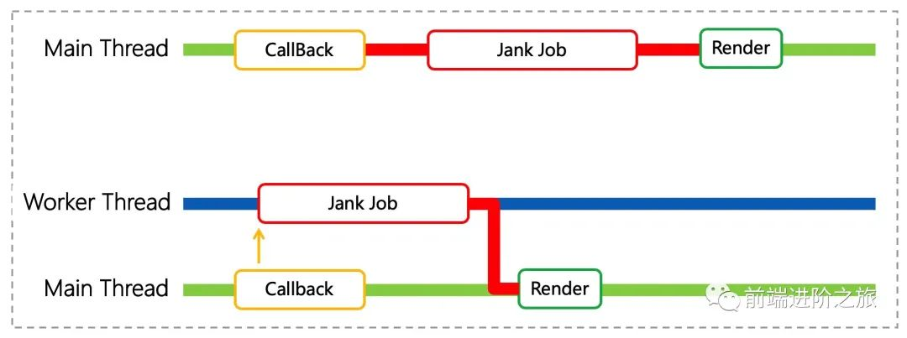
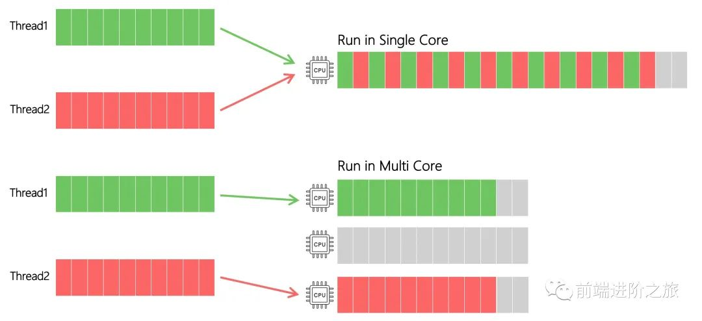
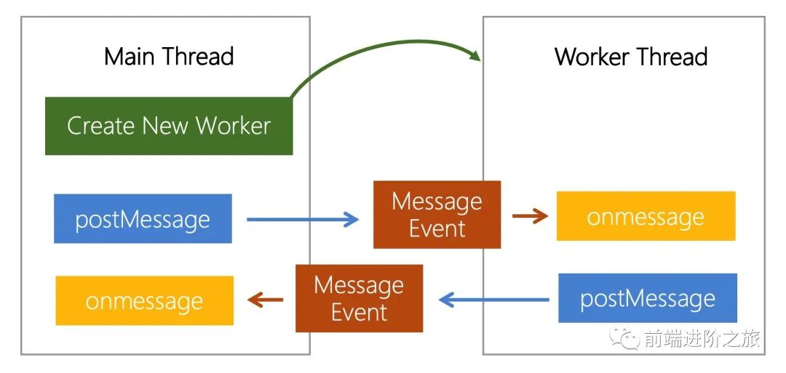
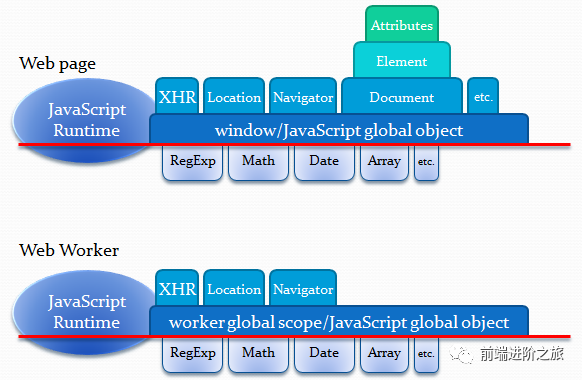

Worker 的使用方式

在webpack配置中添加如下配置：

    ```js
    module.exports = {
    module: {
        rules: [
        {
            test: /\\.worker\\.js$/, // 以 .worker.js 结尾的文件将被 worker-loader 加载
            use: {
            loader: 'worker-loader',
            options: {
                inline: true
                // fallback: false
            }
            }
        }
        ]
    }
    }
```

在浏览器主线程渲染周期内，将可能阻塞页面渲染的 JS 任务迁移到 Worker 线程中，
进而减少主线程的负担，缩短渲染间隔，减少页面卡顿。


性能提升
    Worker 多线程并不会直接带来计算性能的提升，能否提升与设备 CPU 核数和线程策略有关。

多线程和 CPU 核数
    CPU 的单核和多核离前端似乎有点遥远，但在页面运用多线程技术时，核数会影响线程创建策略。
    进程是操作系统 资源分配 的基本单位，线程是操作系统 调度 CPU 的基本单位，操作系统对线程能占用的 CPU 计算资源有复杂的分配策略，如下图所示：
    

Worker 线程策略
    一台设备上相同任务在个线程中运行的时间是一样的，我们将主线程 JS 任务交给新建的 Worker 线程，任务在 Worker 线程上运行并不会比原本主线程更快，而线程新建消耗和通信开销使得渲染间隔可能变得更久。
    真正带来性能提升的是 多核多线程并行。如多个没有依赖关系的同步任务，在单线程上只能串行执行，在多核多线程中可以并行执行。
    值得注意的是，目前移动设备的核心数有限，受限于功耗，移动设备 CPU 中的多核通常是大小核，所以在创建多条 Worker 线程时建议区分场景和设备。

把主线程还给 UI
    Worker 的应用场景，本质上是把主线程的逻辑剥离，让主线程专注于 UI 渲染

Worker API
    通信 API 

    ```js
        // main.js
        const worker = new Worker('./worker.js')
        worker.postMessage('hello')
        worker.onmessage = event => {
            console.log(event.data) // 'world'
        }
        
        // worker.js
        self.onmessage = event => {
            console.log(event.data) // 'hello'
            postMessage('world')
        }
    ```

    postMessage 会在接收线程创建一个 MessageEvent，传递的数据添加到 event.data，再触发该事件；MessageEvent 的回调函数进入 Message Queue，成为 待执行的宏任务。因此 postMessage 顺序发送 的消息，在接收线程中会 顺序执行回调函数。而且我们无需担心实例化 Worker 过程中 postMessage 的信息丢失问题，对此 Worker 内部机制已经处理。

    Worker 事件驱动的通信 API 虽然简洁，但大多数场景下通信需要等待响应，并且多次同类型通信要匹配到各自的响应，所以业务使用一般会封装成 Promise。

运行环境
    在 Worker 线程中运行 JS，会创建 独立于主线程的 JS 运行环境，称之为 DedicatedWorkerGlobalScope，开发者需要关注 Worker 环境和主线程环境的异同，以及 Worker 在不同浏览器中的差异。

Worker 环境和主线程环境的异同
    
    Worker 是无 UI 线程，无法调用 UI 相关的 DOM/BOM API，具体可参考 MDN 的 functions and classes available to workers。
    共同点包括：
        包含完整的 JS 运行时，支持 ES 规范定义的语言语法和内置对象；
        支持 XMLHTTPRequest，能独立发送网络请求和后端进行交互；
        包含只读的 Location，指向 Worker 线程执行的 script url，可通过 url 传递参数给 Worker 环境；
        包含只读的 Navigator，用于获取浏览器信息；
        支持 setTimeout / setInterval 计时器，可用于实现异步逻辑；
        支持 WebSocket 进行网络 I / O，支持 IndexDB 进行文件 I / O。
    
    差异点有：
        Worker 线程没有 DOM API，无法新建和操作 DOM，也无法访问到主线程的 DOM Element；
        Worker 线程和主线程内存独立，Worker 线程无法访问页面上的全局变量（window，document等）和 JS 函数；
        Worker 线程不能调用 alert() 和 confirm() 等 UI 相关的 BOM API；
        Worker 线程被主线程控制，主线程可以新建和销毁 Worker；
        Worker 线程可以通过 self.close 自行销毁。

通信速度
    Worker 多线程虽然实现了 JS 的并行运行，但是也带来了额外的 通信开销。如下图所示，从线程 A 调用 postMessage 发送数据到线程 B，onmessage 接收到数据有时间差，这段时间差成为 通信消耗。

数据传输方式
    我们先来聊聊主线程和 Worker 线程的数据传输方式。根据计算机进程模型，主线程和 Worker 进程同属一个进程，可以访问和操作进程的内存空间，但为了降低多线程并发的逻辑复杂度，部分传输方式直接隔离了线程间的内存，相当于默认加了锁。

通信方式有三种：
    Structured Clone
        Structured Clone 是 postMessage 默认的通信方式，如下图所示，复制一份线程 A 的 js object 内存给到线程 B，线程 B 能获取和操作新复制的内存。
        通过复制内存的方式简单有效的隔离了不同线程的内存，避免冲突；
        如果 object 规模过大，会占用大量的线程时间。

    Transfer Memory
        Transfer Memory 意味着转移内存，它不需要序列化和反序列化，能大大减少传输过程占用的线程时间。
        线程 A 将制定内存的所有权和操作权转交给线程 B，但转然后线程 A 无法在访问这块内存。

    Shared Array Buffer
        Shared Array Buffers 是共享内存，线程 A 和线程 B 可以 同时访问和操作 同一块内存空间，数据都共享了，也就没什么传输的事了。
        但多个并行的线程共享内存，会产生竞争问题，不像前两种传输方式默认加锁，
        兼容性不好