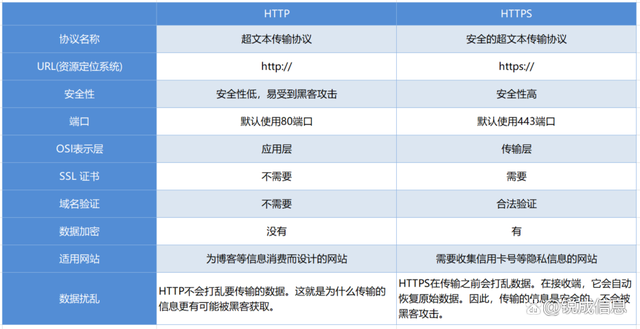

1、http 和 https 的区别？
    HTTPS 是 HTTP 的加密版本。它通过结合 HTTP 和安全套接字层 (SSL) 或传输层安全 (TLS) 协议来加密 Web 服务器和客户端之间传输的数据。HTTPS 加密用于保护敏感数据，例如密码、信用卡号和其他个人信息。

    HTTPS 的工作原理与 HTTP 类似，主要区别在于服务器和客户端之间发送的数据是加密的。这种加密有助于防止未经授权访问敏感数据。

            HTTP            |            HTTPS
                            |   HTTP        应用层
    http        应用层       |   TSL or SSL  安全层
    TCP         传输层       |   TCP         传输层
    IP          网络层       |   IP          网络层
    网络接口     数据链路层   |   网络接口     数据链路层

    HTTP和HTTPS的主要区别:
        1、加密
            加密是 HTTP 和 HTTPS 之间的主要区别之一。HTTPS 使用 SSL 或 TLS 来加密数据，使其比 HTTP 安全得多。当通过 HTTPS 传输时，数据在通过 Internet 发送之前被加密。这种加密有助于防止未经授权访问敏感数据，例如信用卡号和密码。

        2、证书认证
            证书认证是 HTTP 和 HTTPS 的另一个区别。当 Web 浏览器通过 HTTPS 连接到 Web 服务器时，服务器会向浏览器发送数字证书。该证书包含特定于服务器的信息，包括服务器的公钥。浏览器随后使用此证书与服务器建立安全连接。

        3、端口号
            HTTP 使用端口 80，而 HTTPS 使用端口 443。这意味着当您通过 HTTP 访问网站时，URL 以 http:// 开头，而通过 HTTPS 的 URL 以 https:// 开头。

        4、表现
            由于加密和解密数据的额外开销，HTTPS 通常比 HTTP 慢。然而，SSL 和 TLS 协议的进步显着降低了这种开销，使 HTTPS 比以前快得多。

    https 的特点：
        1、安全性：
            HTTPS使用加密技术来保护客户端和服务器之间的通信，保护用户数据的隐私和安全。

        2、可信性：
            HTTPS使用数字证书来验证服务器的身份，确保用户正在连接到正确的服务器。

        3、改善排名：
            Google已明确表示，使用HTTPS将成为搜索排名的一个因素。因此，使用HTTPS可以帮助提高网站的排名。

        4、提供更好的用户体验：
            由于HTTPS可以防止中间人攻击和欺骗，因此用户可以放心地浏览和交互，从而提供更好的用户体验。

2、从 url 输入到页面显示到底发生了什么【https://blog.csdn.net/weixin_47818125/article/details/128985357】
    1.域名解析dns解析
        浏览器缓存 ---> 操作系统缓存 ---> 本机域名服务器 ---> 根 ---> 顶级
        首先在本地域名服务器中查询IP地址，如果没有找到的情况下，本地域名服务器会向根域名服务器发送一个请求，如果根域名服务器也不存在该域名时，本地域名会向com顶级域名服务器发送一个请求，依次类推下去。直到最后本地域名服务器得到google的IP地址并把它缓存到本地，供下次查询使用。从上述过程中，可以看出网址的解析是一个从右向左的过程: com -> google.com -> www.google.com。但是你是否发现少了点什么，根域名服务器的解析过程呢？事实上，真正的网址是www.google.com.，并不是我多打了一个.，这个.对应的就是根域名服务器，默认情况下所有的网址的最后一位都是.，既然是默认情况下，为了方便用户，通常都会省略，浏览器在请求DNS的时候会自动加上，所有网址真正的解析过程为: . -> .com -> google.com. -> www.google.com.。

    2.建立tcp三次连接 

    3.发送http请求
        HTTP请求报文是由三部分组成: 请求行, 请求报头和请求正文。

        以百度为例：https://www.baidu.com:8080/home?name=‘xxx’
            https/http:请求协议
            www.baidu.com:域名
            :8080:端口
            /home:路径
            ?name=‘xxx’:参数
        
    
    4.服务器处理请求并返回http报文
        HTTP响应报文也是由三部分组成: 状态码, 响应报头和响应报文。

    5.浏览器解析渲染页面 （也就是浏览器的运行机制）
        从服务器上获取到代码后，浏览器在内存中开辟一块栈内存，用来给代码的执行提供环境，同时分配一个主线程去一行一行的解析和执行代码，先预编译代码，然后从上到下执行代码，当浏览器遇到link/script/img等请求（引用链接后），都会开辟全新的线程去加载资源文件，并将link/script/img放到TASK QUEUE（任务队列中），然后继续往下执行代码，遇到dom，就生成dom树，将css处理生成CSSOM树，当dom树和css树构建完成时，需要等待task queue任务队列中的任务执行完，当任务队列中的任务执行完成后，就执行Render函数，dom树和css树进行渲染（渲染树），之后就进行回流和重绘，最后display将像素发送给GPU渲染到页面上

        【注：因为js是单线程运行，在同一时间，只能做一件事情，当js从上往下解析/执行代码的时候，遇到外部链接/脚本/微任务/宏任务时，就会将开辟一个全新的线程去加载或者执行外部链接/脚本/微任务/宏任务，也就形成了事件循环Event Loop】

        
            解析 HTML Source，生成 DOM 树。
            解析 CSS，生成 CSSOM 树。
            将 DOM 树和 CSSOM 树结合，去除不可见元素(很重要)，生成渲染树( Render Tree )。
            Layout (布局)：根据生成的渲染树，进行布局( Layout )，得到节点的几何信息(宽度、高度和位置等)。
            Painting (重绘)：根据渲染树以及回流得到的几何信息，将 Render Tree 的每个像素渲染到屏幕上。
            总结：重绘不会带来重新布局,并不一定伴随回流(重排)
        重绘：
            当页面中某些元素的样式发生变化，但是不会影响其在文档流中的位置时，浏览器就会对元素进行重新绘制，这个过程就是重绘。比如：修改元素的背景颜色，字体颜色等

        触发重绘：
            color、background 相关属性：background-color、background-image 等
            outline 相关属性：outline-color、outline-width 、text-decoration
            border-radius、visibility、box-shadow
            回流：
            当渲染树中部分或者全部元素的尺寸、结构或者属性发生变化时，浏览器会重新渲染部分或者全部渲染的过程就叫回流 。比如：改变marge的距离，字体的大小，元素的宽高等

        触发回流：
            页面的首次渲染
            浏览器的窗口大小发生变化
            元素的内容发生变化
            元素的尺寸或者位置发生变化
            元素的字体大小发生变化
            激活CSS伪类
            查询某些属性或者调用某些方法
            添加或者删除可见的DOM元素
            注意： 当触发回流时，一定会触发重绘，但是重绘不一定会引发回流。

        减少回流：
            减少dom的操作
            读写分离（获取元素放一块， 修改元素的宽度高度放一块）
            样式集中修改： divStyle.cssText = ‘width:100px;height:100px;border:1px solid black’
            元素批量修改：使用文档碎片，createDocumentFragment 将需要创建的元素一次性创建再一次性拼接到dom上
            动画效果应用到position 属性为absolute或fixed的元素上（脱离文档流）
            减少table布局

    6.断开连接：当数据传送完毕后，需要断开tcp连接，此时发送tcp四次挥手
        