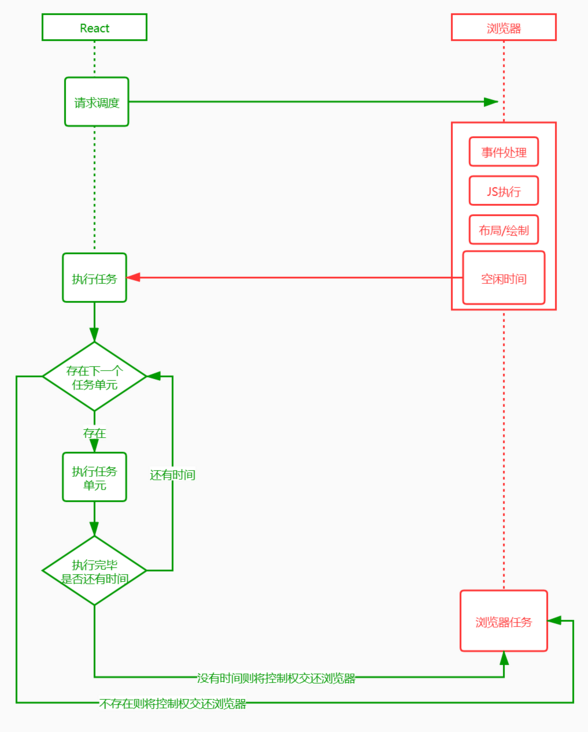

1、react的合成事件知多少？
    1、react自身实现了一套事件机制，包括事件的注册、事件的存储、事件的合成及执行等。
    2、react 的所有事件并没有绑定到具体的dom节点上而是绑定在了 document/root 节点上，然后由统一的事件处理程序来派发执行。
    3、通过这种处理，减少了事件注册的次数，另外react还在事件合成过程中，对不同浏览器的事件进行了封装处理，抹平浏览器之间的事件差异。
    4、React 利用事件委托机制，将几乎所有事件的触发代理（delegate）在 document/root 节点上，事件对象(event)是合成对象(SyntheticEvent)，不是原生事件对象，但通过 nativeEvent 属性访问原生事件对象。
    5、由于 React 的事件委托机制，React 组件对应的原生 DOM 节点上的事件触发时机总是在 React 组件上的事件之前。

    事件机制流程：
        1、在组件挂载阶段，根据组件内声明的事件类型【onclick，onchange】等，给 document/root 节点上添加事件【addEventListener】，并指定统一的事件处理程序【dispatchEvent】。
        2、react 把所有的事件和事件类型以及 react 组件进行关联，把这个关系保存在了一个 map 里，也就是一个对象里（键值对）listenerBank，然后在事件触发的时候去根据当前的 组件id【key1】和 事件类型【click】查找到对应的 事件fn；
            {
                click: { key1: fn1, key2: fn2 },
                change: { key1: fn1, key2: fn2 },
            }

    事件的执行：
        1、进入统一的事件分发函数(dispatchEvent)
        2、结合原生事件找到当前节点对应的ReactDOMComponent对象
        3、开始 事件的合成
            根据当前事件类型生成指定的合成对象
            封装原生事件和冒泡机制
            在 listenerBank 事件池中查找事件回调并合成到 event(合成事件结束)
        4.处理合成事件内的回调事件（事件触发完成 end）

    优点：
     1、兼容性好；
     2、使用事件委托机制，性能高；

2、class 类中 constroctor 函数中的 super() 有什么用？
    super() 用来调用父类的构造函数，并把props传递给父类构造函数；
    在没有props的情况下，可以不调用super()

3、react Fiber 了解多少？
    React渲染页面的两个阶段：
        1、调度阶段（reconciliation）：在这个阶段 React 会更新数据生成新的 Virtual DOM，然后通过Diff算法，快速找出需要更新的元素，放到更新队列中去，得到新的更新队列。
        2、渲染阶段（commit）：这个阶段 React 会遍历更新队列，将其所有的变更一次性更新到DOM上。
    React16架构可以分为三层：
        Scheduler（调度器）—— 调度任务的优先级，高优任务优先进入Reconciler,react团队实现的requestIdleCallback；
        Reconciler（协调器）—— 负责找出变化的组件：更新工作从递归变成了可以中断的循环过程。Reconciler内部采用了Fiber的架构；
        Renderer（渲染器）—— 负责将变化的组件渲染到页面上
    React Fiber 中的时间分片
        把一个耗时长的任务分成很多小片，每一个小片的运行时间很短，虽然总时间依然很长，但是在每个小片执行完之后，都给其他任务一个执行的机会，这样唯一的线程就不会被独占，其他任务依然有运行的机会。
        React Fiber 把更新过程碎片化，每执行完一段更新过程，就把控制权交还给 React 负责任务协调的模块，看看有没有其他紧急任务要做，如果没有就继续去更新，如果有紧急任务，那就去做紧急任务。
    Stack Reconciler
        基于栈的 Reconciler，浏览器引擎会从执行栈的顶端开始执行，执行完毕就弹出当前执行上下文，开始执行下一个函数，直到执行栈被清空才会停止。然后将执行权交还给浏览器。由于 React 将页面视图视作一个个函数执行的结果。每一个页面往往由多个视图组成，这就意味着多个函数的调用。
    Fiber Reconciler
        在 React Fiber 中用链表遍历的方式替代了 React 16 之前的栈递归方案。在 React 16 中使用了大量的链表。
            使用多向链表的形式替代了原来的树结构；
            副作用单链表；
            状态更新单链表；
        链表相比顺序结构数据格式的好处就是：
            操作更高效，比如顺序调整、删除，只需要改变节点的指针指向就好了。
            不仅可以根据当前节点找到下一个节点，在多向链表中，还可以找到他的父节点或者兄弟节点。
        但链表也不是完美的，缺点就是：
            比顺序结构数据更占用空间，因为每个节点对象还保存有指向下一个对象的指针。
            不能自由读取，必须找到他的上一个节点。
            React 用空间换时间，更高效的操作可以方便根据优先级进行操作。同时可以根据当前节点找到其他节点，在下面提到的挂起和恢复过程中起到了关键作用。
    React Fiber 是如何实现更新过程可控？
        任务拆分
            在 React Fiber 机制中，它采用"化整为零"的思想，将调和阶段（Reconciler）递归遍历 VDOM 这个大任务分成若干小任务，每个任务只负责一个节点的处理。

        任务挂起、恢复、终止
            workInProgress tree
                workInProgress 代表当前正在执行更新的 Fiber 树。在 render 或者 setState 后，会构建一颗 Fiber 树，也就是 workInProgress tree，这棵树在构建每一个节点的时候会收集当前节点的副作用，整棵树构建完成后，会形成一条完整的副作用链。

            currentFiber tree
                currentFiber 表示上次渲染构建的 Filber 树。在每一次更新完成后 workInProgress 会赋值给 currentFiber。在新一轮更新时 workInProgress tree 再重新构建，新 workInProgress 的节点通过 alternate 属性和 currentFiber 的节点建立联系。

                在新 workInProgress tree 的创建过程中，会同 currentFiber 的对应节点进行 Diff 比较，收集副作用。同时也会复用和 currentFiber 对应的节点对象，减少新创建对象带来的开销。也就是说无论是创建还是更新、挂起、恢复以及终止操作都是发生在 workInProgress tree 创建过程中的。workInProgress tree 构建过程其实就是循环的执行任务和创建下一个任务。

            挂起
                当第一个小任务完成后，先判断这一帧是否还有空闲时间，没有就挂起下一个任务的执行，记住当前挂起的节点，让出控制权给浏览器执行更高优先级的任务。

            恢复
                在浏览器渲染完一帧后，判断当前帧是否有剩余时间，如果有就恢复执行之前挂起的任务。如果没有任务需要处理，代表调和阶段完成，可以开始进入渲染阶段。

                如何判断一帧是否有空闲时间的呢？

                使用前面提到的 RIC (RequestIdleCallback) 浏览器原生 API，React 源码中为了兼容低版本的浏览器，对该方法进行了 Polyfill。

                恢复执行的时候又是如何知道下一个任务是什么呢？

                是在前面提到的链表。在 React Fiber 中每个任务其实就是在处理一个 FiberNode 对象，然后又生成下一个任务需要处理的 FiberNode。

            终止
                其实并不是每次更新都会走到提交阶段。当在调和过程中触发了新的更新，在执行下一个任务的时候，判断是否有优先级更高的执行任务，如果有就终止原来将要执行的任务，开始新的 workInProgressFiber 树构建过程，开始新的更新流程。这样可以避免重复更新操作。这也是在 React 16 以后生命周期函数 componentWillMount 有可能会执行多次的原因。

----------- 任务调度 

        任务具备优先级

        Fiber 结构:
            class FiberNode {
                constructor(tag, pendingProps, key, mode) {
                    // 实例属性
                    this.tag = tag; // 标记不同组件类型，如函数组件、类组件、文本、原生组件...
                    this.key = key; // react 元素上的 key 就是 jsx 上写的那个 key ，也就是最终 ReactElement 上的
                    this.elementType = null; // createElement的第一个参数，ReactElement 上的 type
                    this.type = null; // 表示fiber的真实类型 ，elementType 基本一样，在使用了懒加载之类的功能时可能会不一样
                    this.stateNode = null; // 实例对象，比如 class 组件 new 完后就挂载在这个属性上面，如果是RootFiber，那么它上面挂的是 FiberRoot,如果是原生节点就是 dom 对象
                    // fiber
                    this.return = null; // 父节点，指向上一个 fiber
                    this.child = null; // 子节点，指向自身下面的第一个 fiber
                    this.sibling = null; // 兄弟组件, 指向一个兄弟节点
                    this.index = 0; //  一般如果没有兄弟节点的话是0 当某个父节点下的子节点是数组类型的时候会给每个子节点一个 index，index 和 key 要一起做 diff
                    this.ref = null; // reactElement 上的 ref 属性
                    this.pendingProps = pendingProps; // 新的 props
                    this.memoizedProps = null; // 旧的 props
                    this.updateQueue = null; // fiber 上的更新队列执行一次 setState 就会往这个属性上挂一个新的更新, 每条更新最终会形成一个链表结构，最后做批量更新
                    this.memoizedState = null; // 对应  memoizedProps，上次渲染的 state，相当于当前的 state，理解成 prev 和 next 的关系
                    this.mode = mode; // 表示当前组件下的子组件的渲染方式
                    // effects
                    this.effectTag = NoEffect; // 表示当前 fiber 要进行何种更新（更新、删除等）
                    this.nextEffect = null; // 指向下个需要更新的fiber
                    this.firstEffect = null; // 指向所有子节点里，需要更新的 fiber 里的第一个
                    this.lastEffect = null; // 指向所有子节点中需要更新的 fiber 的最后一个
                    this.expirationTime = NoWork; // 过期时间，代表任务在未来的哪个时间点应该被完成
                    this.childExpirationTime = NoWork; // child 过期时间
                    this.alternate = null; // current 树和 workInprogress 树之间的相互引用
                }
            }

4、React的Diff算法？
    1、根节点不同：删除重新创建
    2、根节点相同：
        比较他们的属性变化，更新属性；
    3、同级多个节点的Diff：
        用新集合中的节点去和老集合中的节点进行diff
        diff结束后，如果新集合中还有未进行diff的节点，说明该节点是需要新增的，对该节点执行新增逻辑。
        diff结束后，如果老集合中还有未进行diff的节点，说明该节点是需要删除的，对该节点执行删除逻辑。

        diff过程：
            index：新集合遍历下标
            oldIndex：当前节点在老集合的下标
            maxIndex：在新集合访问过的节点中，其在老集合的最大下标

            当oldIndex > maxIndex 时：将oldIndex 赋值给maxIndex；
            当oldIndex = maxIndex 时：不移动；
            当oldIndex < maxIndex 时：将当前节点移动到index位置；

5、react 项目性能优化？
    1、将变的部分和不变的部分分离：
        当父组件满足性能优化的条件时；子孙组件可能命中性能优化；
    2、步骤：
        1、寻找项目中的性能损耗严重的子树；
        2、在子树的根节点使用性能优化API
        3、子树中应用变与不变分离原则